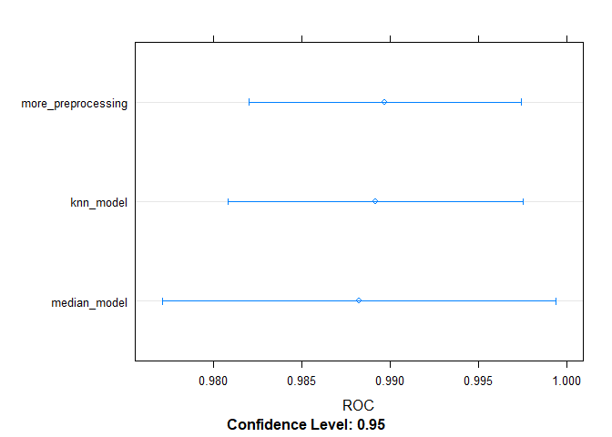

Machine Learning with `caret` in R (DataCamp)
================
true
02 August, 2020


## Regression models: fitting them and evaluating their performance

### Supervised vs. Unsupersived Learning

  - Predictive Modeling = Supervised Learning
  - Supervised Learning = Machine Learning if you have a target variable
  - Two types of predictive modeling
      - Classification (Qualitative)
      - Regression (Quantitative)

### Evaluating Model Perfomance

  - Use *metrics* to evaluate a model. It is:
      - Quantifiable
      - Objective
  - *Root Mean Squared Error* (RMSE) for regression
  - Common to calculate in-sample RMSE. Problems:
      - Too optimistic since model is trained on the same data that you
        are calculating RMSE on
      - Leads to overfitting
  - Better to calculate out-of-sample error
      - Simulates real world usage
      - Helps avoid overfitting

<!-- end list -->

``` r
## Computing the RMSE on the diamonds data set
library(caret)
```

    ## Loading required package: lattice

    ## Loading required package: ggplot2

``` r
library(ggplot2)
library(tidyverse)
```

    ## -- Attaching packages ---------------------------------------------------------------------------------- tidyverse 1.3.0 --

    ## v tibble  3.0.1     v dplyr   1.0.0
    ## v tidyr   1.1.0     v stringr 1.4.0
    ## v readr   1.3.1     v forcats 0.5.0
    ## v purrr   0.3.4

    ## -- Conflicts ------------------------------------------------------------------------------------- tidyverse_conflicts() --
    ## x dplyr::filter() masks stats::filter()
    ## x dplyr::lag()    masks stats::lag()
    ## x purrr::lift()   masks caret::lift()

``` r
library(dplyr)
data("diamonds")

# Fit lm model: model
model <- lm(price ~ ., diamonds) 

# Predict on full data: p
p <- predict(model, type="response")

# Compute errors: error
error <- p - diamonds$price

# Calculate RMSE
sqrt(mean((error)^2))
```

    ## [1] 1129.843

### Out-of-sample error measures

  - Objective: Want models that don’t overfit and generalize well
    (\(\neq\) explanatory modeling)
  - Do the models perform well on new data?
  - Test models on new data, or test set
      - Key insight of machine learning
      - In-sample validation almost guarantees overfitting ==\> We try
        to simulate this by applying a train/test split

<!-- end list -->

``` r
## First we randomly shuffle the data so that potential clusters or imbalances are disaggregated
# Set seed so this can be reproduced
set.seed(42)

# Shuffle row indices: rows
rows <- sample(nrow(diamonds)) 

# Randomly order data
shuffled_diamonds <- diamonds[rows,]

# Determine row to split on: split (at 80%)
split <- round(nrow(shuffled_diamonds)*0.8)

# Create train
train <- shuffled_diamonds[1:split,]

# Create test
test <- shuffled_diamonds[(split+1):nrow(shuffled_diamonds),]

# Fit lm model on train: model
model <- lm(price ~ ., train) 

# Predict on test: p
p <- predict(model, test)

# Compute errors: error
error <- p - test$price

# Calculate RMSE
sqrt(mean(error^2))
```

    ## [1] 1137.466

``` r
# The model is worse than we initially thought!
```

### Cross-validation

  - One simple split is fragile as a process, as one single outlier
    could cause problems
  - Better approach is to have several test done, with: - Equally sized
    test sets
      - Over k-fold amount of sets (e.g. ten)
      - And averaging out the out-of-sample error measures
  - The `train` function (`caret`) can do that for us\!

<!-- end list -->

``` r
# Fit lm model using 10-fold CV: model
model <- train(
  price ~ ., 
  diamonds,
  method = "lm",
  trControl = trainControl(
    method = "cv", 
    number = 10,
    verboseIter = TRUE
  )
)
```

    ## + Fold01: intercept=TRUE 
    ## - Fold01: intercept=TRUE 
    ## + Fold02: intercept=TRUE 
    ## - Fold02: intercept=TRUE 
    ## + Fold03: intercept=TRUE 
    ## - Fold03: intercept=TRUE 
    ## + Fold04: intercept=TRUE 
    ## - Fold04: intercept=TRUE 
    ## + Fold05: intercept=TRUE 
    ## - Fold05: intercept=TRUE 
    ## + Fold06: intercept=TRUE 
    ## - Fold06: intercept=TRUE 
    ## + Fold07: intercept=TRUE 
    ## - Fold07: intercept=TRUE 
    ## + Fold08: intercept=TRUE 
    ## - Fold08: intercept=TRUE 
    ## + Fold09: intercept=TRUE 
    ## - Fold09: intercept=TRUE 
    ## + Fold10: intercept=TRUE 
    ## - Fold10: intercept=TRUE 
    ## Aggregating results
    ## Fitting final model on full training set

``` r
# Print model to console
model
```

    ## Linear Regression 
    ## 
    ## 53940 samples
    ##     9 predictor
    ## 
    ## No pre-processing
    ## Resampling: Cross-Validated (10 fold) 
    ## Summary of sample sizes: 48547, 48546, 48546, 48547, 48545, 48547, ... 
    ## Resampling results:
    ## 
    ##   RMSE      Rsquared   MAE     
    ##   1131.015  0.9196398  740.6117
    ## 
    ## Tuning parameter 'intercept' was held constant at a value of TRUE

``` r
# Fit lm model using 5-fold CV: model
library(MASS)
```

    ## 
    ## Attaching package: 'MASS'

    ## The following object is masked from 'package:dplyr':
    ## 
    ##     select

``` r
data(Boston)
model <- train(
  medv ~., 
  Boston,
  method = "lm",
  trControl = trainControl(
    method = "cv", 
    number = 5,
    verboseIter = TRUE
  )
)
```

    ## + Fold1: intercept=TRUE 
    ## - Fold1: intercept=TRUE 
    ## + Fold2: intercept=TRUE 
    ## - Fold2: intercept=TRUE 
    ## + Fold3: intercept=TRUE 
    ## - Fold3: intercept=TRUE 
    ## + Fold4: intercept=TRUE 
    ## - Fold4: intercept=TRUE 
    ## + Fold5: intercept=TRUE 
    ## - Fold5: intercept=TRUE 
    ## Aggregating results
    ## Fitting final model on full training set

``` r
# Print model to console
model
```

    ## Linear Regression 
    ## 
    ## 506 samples
    ##  13 predictor
    ## 
    ## No pre-processing
    ## Resampling: Cross-Validated (5 fold) 
    ## Summary of sample sizes: 405, 405, 406, 403, 405 
    ## Resampling results:
    ## 
    ##   RMSE      Rsquared   MAE     
    ##   4.860247  0.7209221  3.398114
    ## 
    ## Tuning parameter 'intercept' was held constant at a value of TRUE

``` r
## We can repeat the process of CV ("repeats")
# Fit lm model using 5 x 5-fold CV: model
model <- train(
  medv ~ ., 
  Boston,
  method = "lm",
  trControl = trainControl(
    method = "repeatedcv", 
    number = 5,
    repeats = 5, 
    verboseIter = TRUE
  )
)
```

    ## + Fold1.Rep1: intercept=TRUE 
    ## - Fold1.Rep1: intercept=TRUE 
    ## + Fold2.Rep1: intercept=TRUE 
    ## - Fold2.Rep1: intercept=TRUE 
    ## + Fold3.Rep1: intercept=TRUE 
    ## - Fold3.Rep1: intercept=TRUE 
    ## + Fold4.Rep1: intercept=TRUE 
    ## - Fold4.Rep1: intercept=TRUE 
    ## + Fold5.Rep1: intercept=TRUE 
    ## - Fold5.Rep1: intercept=TRUE 
    ## + Fold1.Rep2: intercept=TRUE 
    ## - Fold1.Rep2: intercept=TRUE 
    ## + Fold2.Rep2: intercept=TRUE 
    ## - Fold2.Rep2: intercept=TRUE 
    ## + Fold3.Rep2: intercept=TRUE 
    ## - Fold3.Rep2: intercept=TRUE 
    ## + Fold4.Rep2: intercept=TRUE 
    ## - Fold4.Rep2: intercept=TRUE 
    ## + Fold5.Rep2: intercept=TRUE 
    ## - Fold5.Rep2: intercept=TRUE 
    ## + Fold1.Rep3: intercept=TRUE 
    ## - Fold1.Rep3: intercept=TRUE 
    ## + Fold2.Rep3: intercept=TRUE 
    ## - Fold2.Rep3: intercept=TRUE 
    ## + Fold3.Rep3: intercept=TRUE 
    ## - Fold3.Rep3: intercept=TRUE 
    ## + Fold4.Rep3: intercept=TRUE 
    ## - Fold4.Rep3: intercept=TRUE 
    ## + Fold5.Rep3: intercept=TRUE 
    ## - Fold5.Rep3: intercept=TRUE 
    ## + Fold1.Rep4: intercept=TRUE 
    ## - Fold1.Rep4: intercept=TRUE 
    ## + Fold2.Rep4: intercept=TRUE 
    ## - Fold2.Rep4: intercept=TRUE 
    ## + Fold3.Rep4: intercept=TRUE 
    ## - Fold3.Rep4: intercept=TRUE 
    ## + Fold4.Rep4: intercept=TRUE 
    ## - Fold4.Rep4: intercept=TRUE 
    ## + Fold5.Rep4: intercept=TRUE 
    ## - Fold5.Rep4: intercept=TRUE 
    ## + Fold1.Rep5: intercept=TRUE 
    ## - Fold1.Rep5: intercept=TRUE 
    ## + Fold2.Rep5: intercept=TRUE 
    ## - Fold2.Rep5: intercept=TRUE 
    ## + Fold3.Rep5: intercept=TRUE 
    ## - Fold3.Rep5: intercept=TRUE 
    ## + Fold4.Rep5: intercept=TRUE 
    ## - Fold4.Rep5: intercept=TRUE 
    ## + Fold5.Rep5: intercept=TRUE 
    ## - Fold5.Rep5: intercept=TRUE 
    ## Aggregating results
    ## Fitting final model on full training set

``` r
# Print model to console
model
```

    ## Linear Regression 
    ## 
    ## 506 samples
    ##  13 predictor
    ## 
    ## No pre-processing
    ## Resampling: Cross-Validated (5 fold, repeated 5 times) 
    ## Summary of sample sizes: 405, 406, 405, 403, 405, 405, ... 
    ## Resampling results:
    ## 
    ##   RMSE      Rsquared   MAE     
    ##   4.845724  0.7277269  3.402735
    ## 
    ## Tuning parameter 'intercept' was held constant at a value of TRUE

``` r
## By using "train" we simultaneously fit a model that we can predict. (model -> list -> final model)

pr <- predict(model, Boston)
head(pr)
```

    ##        1        2        3        4        5        6 
    ## 30.00384 25.02556 30.56760 28.60704 27.94352 25.25628

## Classification models: fitting them and evaluating their performance

### Logistic Regression on `sonar`

  - Classification Models:
      - Categorical (i.e. qualitative) target variable
      - Example: will a loan default?
      - Still a form of supervised learning
      - Use a train/test split to evaluate performance
  - Splitting the data:
      - The task will include a logistic regression on the `sonar` data
        set, to predict rocks/mines.
      - Here we will use a 60/40 split for Cross-Validation

<!-- end list -->

``` r
library(mlbench)
data("Sonar")

set.seed(313)
# Get the number of observations
n_obs <- nrow(Sonar)

# Shuffle row indices: permuted_rows
permuted_rows <- sample(n_obs)

# Randomly order data: Sonar
Sonar_shuffled <- Sonar[permuted_rows,]

# Identify row to split on: split
split <- round(n_obs * 0.6)

# Create train
train <- Sonar_shuffled[1:split,]

# Create test
test <- Sonar_shuffled[(split+1):n_obs,]

# Did the split work? Yes!
list(nrow(test)/nrow(Sonar), nrow(train)/nrow(Sonar))
```

    ## [[1]]
    ## [1] 0.3990385
    ## 
    ## [[2]]
    ## [1] 0.6009615

``` r
# Fit glm model: model
model <- glm(Class ~ ., binomial(link = "logit"), data=train)
```

    ## Warning: glm.fit: algorithm did not converge

    ## Warning: glm.fit: fitted probabilities numerically 0 or 1 occurred

``` r
## Don't worry of the fit not converging
# Predict on test: p
p <- predict.glm(model, newdata=test, type="response")
```

### Confusion matrix

We use this to evaluate the performance of a classification model. We
display predicted classes vs. actual outcomes Confusion matrix: As
whether an outcome got “confused” for anouther. Typically it’ll look
like this:

|                |         |   **Reference**   |                   |
| -------------- | :-----: | :---------------: | ----------------- |
|                |         |      **Yes**      | **No**            |
| **Prediction** | **Yes** | *True Positives*  | *False Positives* |
|                | **No**  | *False Negatives* | *True Negatives*  |

As we usually predict probabilities in regards to categorical data and
not linear predictions (don’t get it confused with the linear
combination of the regression model), the objective should be to find a
measure to code the probabilities into a binary outcome. Here we can
turn the probabilities into classes by choosing a threshold at which a
greater value is a positive and a lower value is a negative outcome.

``` r
# If p exceeds threshold of 0.5 (50%), M else R: m_or_r
m_or_r <- ifelse(p > 0.5, "M", "R")

# Convert to factor: p_class
p_class <- as.factor(m_or_r)

# Create confusion matrix
confusionMatrix(p_class, test$Class)
```

    ## Confusion Matrix and Statistics
    ## 
    ##           Reference
    ## Prediction  M  R
    ##          M 19 27
    ##          R 29  8
    ##                                          
    ##                Accuracy : 0.3253         
    ##                  95% CI : (0.2265, 0.437)
    ##     No Information Rate : 0.5783         
    ##     P-Value [Acc > NIR] : 1.0000         
    ##                                          
    ##                   Kappa : -0.3727        
    ##                                          
    ##  Mcnemar's Test P-Value : 0.8937         
    ##                                          
    ##             Sensitivity : 0.3958         
    ##             Specificity : 0.2286         
    ##          Pos Pred Value : 0.4130         
    ##          Neg Pred Value : 0.2162         
    ##              Prevalence : 0.5783         
    ##          Detection Rate : 0.2289         
    ##    Detection Prevalence : 0.5542         
    ##       Balanced Accuracy : 0.3122         
    ##                                          
    ##        'Positive' Class : M              
    ## 

``` r
### What do we see:
# Accuracy: How correct were we (percentage)
# No Information Rate: How correct would we have been, if we predicted everything as the most dominant class (here Mines)
# Sensitivity: True Positives Rate
# Specificity: True Negatives Rate
```

  - Not limited to to 50% threshold
      - 10% would catch more mines with less certainty (higher false
        positive; higher true positives)
      - 90% would catch fewer mines with more certainty (lower false
        positive: lower true positives)
  - Choosing a threshold means a balance between true positive and false
    positive rates
  - Choosing threshold is dependent on cost-benefit-analysis

<!-- end list -->

``` r
# If p exceeds threshold of 0.9 (90%), M else R: m_or_r
m_or_r <- ifelse(p>0.9, "M", "R")

# Convert to factor: p_class
p_class <- as.factor(m_or_r)

# Create confusion matrix
confusionMatrix(p_class, test$Class)
```

    ## Confusion Matrix and Statistics
    ## 
    ##           Reference
    ## Prediction  M  R
    ##          M 18 27
    ##          R 30  8
    ##                                           
    ##                Accuracy : 0.3133          
    ##                  95% CI : (0.2159, 0.4244)
    ##     No Information Rate : 0.5783          
    ##     P-Value [Acc > NIR] : 1.0000          
    ##                                           
    ##                   Kappa : -0.3919         
    ##                                           
    ##  Mcnemar's Test P-Value : 0.7911          
    ##                                           
    ##             Sensitivity : 0.3750          
    ##             Specificity : 0.2286          
    ##          Pos Pred Value : 0.4000          
    ##          Neg Pred Value : 0.2105          
    ##              Prevalence : 0.5783          
    ##          Detection Rate : 0.2169          
    ##    Detection Prevalence : 0.5422          
    ##       Balanced Accuracy : 0.3018          
    ##                                           
    ##        'Positive' Class : M               
    ## 

``` r
# If p exceeds threshold of 0.1, M else R: m_or_r
m_or_r <- ifelse(p > 0.1, "M", "R")

# Convert to factor: p_class
p_class <- as.factor(m_or_r)

# Create confusion matrix
confusionMatrix(p_class, test$Class)
```

    ## Confusion Matrix and Statistics
    ## 
    ##           Reference
    ## Prediction  M  R
    ##          M 19 27
    ##          R 29  8
    ##                                          
    ##                Accuracy : 0.3253         
    ##                  95% CI : (0.2265, 0.437)
    ##     No Information Rate : 0.5783         
    ##     P-Value [Acc > NIR] : 1.0000         
    ##                                          
    ##                   Kappa : -0.3727        
    ##                                          
    ##  Mcnemar's Test P-Value : 0.8937         
    ##                                          
    ##             Sensitivity : 0.3958         
    ##             Specificity : 0.2286         
    ##          Pos Pred Value : 0.4130         
    ##          Neg Pred Value : 0.2162         
    ##              Prevalence : 0.5783         
    ##          Detection Rate : 0.2289         
    ##    Detection Prevalence : 0.5542         
    ##       Balanced Accuracy : 0.3122         
    ##                                          
    ##        'Positive' Class : M              
    ## 

### Intoducing the ROC curve

The challenge with evaluating the performance of a classification model
via confusion matrices is to find the right amount of thresholds (many)
without arbitrarily running a sequence classifications and ending up
overlooking important thresholds.

  - The challenge:
      - Many possible classification thresholds
      - Requires manual work to choose
      - Easy to overlook a particular threshold
      - We need a more systematic approach
  - ROC Curves:
      - Plot true/false positive rate at every possible threshold
      - Visualize tradeoffs between two extremes (100% true positives vs
        0% false positive)
      - Result is an ROC curve

<!-- end list -->

``` r
library(caTools)
colAUC(p, test$Class, plotROC = TRUE)
```

<!-- -->

    ##              [,1]
    ## M vs. R 0.7366071

``` r
# Every point shows us a threshold
# Y-Axis: True positives
# X-Axis: False positives
```

### Area under the curve (AUC)

  - We can say following about the curve itself:
      - Random predictions would follow a (close to) linear line
      - Perfect predictions would create something like a box, where a
        single point would predict all positives while detecting no
        false positives. Results in a lot of space under the curve
      - Perfectly incorrect predictions (rarely happen) would create a
        box with the opposite factum - no true positives all false
        positives. Results in no space under the curve.
  - The area under the curve (AUC) would basically tell us how good
    model perform. Numerically speaking this would mean:
      - All the space under the curve is available = perfect prediction
        = Values as 1
      - Half of the space under the curve is available = random
        prediction = Values as 0.5
      - No space under the curve is available = perfectly false
        prediction = Values as 0
  - Defining AUC as a metric:
      - Single-number summary of model accuracy
      - Summarizes performance accross all thresholds
      - Can be used to rank different models within the same dataset

<!-- end list -->

``` r
# Create trainControl object: myControl
# This allows use to feed this to the train function
# We use 10 iterations here for the cross-validation
# we use a twoClassSummary wo the binary outcome to be produced (instead of defaultSummary)
# When choosing twoClassSummary we need to set classProbs on True
# We are trying to get evualuation metrics over a 10-fold cross validation and averaging them out.
myControl <- trainControl(
  method = "cv",
  number = 10,
  summaryFunction = twoClassSummary,
  classProbs = TRUE, # IMPORTANT!
  verboseIter = TRUE
)

# Train glm with custom trainControl: model
model <- train(Class ~., Sonar, method="glm", trControl=myControl)
```

    ## Warning in train.default(x, y, weights = w, ...): The metric "Accuracy" was not
    ## in the result set. ROC will be used instead.

    ## + Fold01: parameter=none

    ## Warning: glm.fit: algorithm did not converge

    ## Warning: glm.fit: fitted probabilities numerically 0 or 1 occurred

    ## - Fold01: parameter=none 
    ## + Fold02: parameter=none

    ## Warning: glm.fit: algorithm did not converge
    
    ## Warning: glm.fit: fitted probabilities numerically 0 or 1 occurred

    ## - Fold02: parameter=none 
    ## + Fold03: parameter=none

    ## Warning: glm.fit: algorithm did not converge
    
    ## Warning: glm.fit: fitted probabilities numerically 0 or 1 occurred

    ## - Fold03: parameter=none 
    ## + Fold04: parameter=none

    ## Warning: glm.fit: algorithm did not converge
    
    ## Warning: glm.fit: fitted probabilities numerically 0 or 1 occurred

    ## - Fold04: parameter=none 
    ## + Fold05: parameter=none

    ## Warning: glm.fit: algorithm did not converge
    
    ## Warning: glm.fit: fitted probabilities numerically 0 or 1 occurred

    ## - Fold05: parameter=none 
    ## + Fold06: parameter=none

    ## Warning: glm.fit: algorithm did not converge
    
    ## Warning: glm.fit: fitted probabilities numerically 0 or 1 occurred

    ## - Fold06: parameter=none 
    ## + Fold07: parameter=none

    ## Warning: glm.fit: algorithm did not converge
    
    ## Warning: glm.fit: fitted probabilities numerically 0 or 1 occurred

    ## - Fold07: parameter=none 
    ## + Fold08: parameter=none

    ## Warning: glm.fit: algorithm did not converge
    
    ## Warning: glm.fit: fitted probabilities numerically 0 or 1 occurred

    ## - Fold08: parameter=none 
    ## + Fold09: parameter=none

    ## Warning: glm.fit: algorithm did not converge
    
    ## Warning: glm.fit: fitted probabilities numerically 0 or 1 occurred

    ## - Fold09: parameter=none 
    ## + Fold10: parameter=none

    ## Warning: glm.fit: algorithm did not converge
    
    ## Warning: glm.fit: fitted probabilities numerically 0 or 1 occurred

    ## - Fold10: parameter=none 
    ## Aggregating results
    ## Fitting final model on full training set

    ## Warning: glm.fit: algorithm did not converge
    
    ## Warning: glm.fit: fitted probabilities numerically 0 or 1 occurred

``` r
# Print model to console
model
```

    ## Generalized Linear Model 
    ## 
    ## 208 samples
    ##  60 predictor
    ##   2 classes: 'M', 'R' 
    ## 
    ## No pre-processing
    ## Resampling: Cross-Validated (10 fold) 
    ## Summary of sample sizes: 188, 187, 188, 187, 187, 187, ... 
    ## Resampling results:
    ## 
    ##   ROC        Sens       Spec     
    ##   0.7202399  0.7287879  0.6944444

``` r
# ROC is aight but not amazing. Better than random.
```

## Tuning model parameters to improve performance

### Random forests and wine

  - Random forest
      - Popular type of machien learning model
      - Good for beginners
      - Robust to overfitting
      - Yield very accurate, non-linear models
      - Default values often OK, but occasionally need adjustment
      - These adjustments on hyperparameters need to be manually
        justified, unlike other methods like the slope in a linear model
  - What does it do?
      - Start with a simple desicion tree
      - Decision trees are fast, but not very accurate
      - Random forests improve accuracy by fitting many trees
      - Fit each one to a bootstrap sample of your data
      - Called *bootstrap aggregation* or *bagging*
      - Randomly sample columns at each split. Meaning what information
        the decision split will be based on (randomly)
      - Each individual tree in the random forest spits out a class
        prediction and the class with the most votes becomes our model’s
        prediction

<!-- end list -->

``` r
white.url <- "https://archive.ics.uci.edu/ml/machine-learning-databases/wine-quality/winequality-white.csv"
white.raw <- read.csv(white.url, header = TRUE, sep = ";")
wine <- white.raw
glimpse(wine)
```

    ## Rows: 4,898
    ## Columns: 12
    ## $ fixed.acidity        <dbl> 7.0, 6.3, 8.1, 7.2, 7.2, 8.1, 6.2, 7.0, 6.3, 8...
    ## $ volatile.acidity     <dbl> 0.27, 0.30, 0.28, 0.23, 0.23, 0.28, 0.32, 0.27...
    ## $ citric.acid          <dbl> 0.36, 0.34, 0.40, 0.32, 0.32, 0.40, 0.16, 0.36...
    ## $ residual.sugar       <dbl> 20.70, 1.60, 6.90, 8.50, 8.50, 6.90, 7.00, 20....
    ## $ chlorides            <dbl> 0.045, 0.049, 0.050, 0.058, 0.058, 0.050, 0.04...
    ## $ free.sulfur.dioxide  <dbl> 45, 14, 30, 47, 47, 30, 30, 45, 14, 28, 11, 17...
    ## $ total.sulfur.dioxide <dbl> 170, 132, 97, 186, 186, 97, 136, 170, 132, 129...
    ## $ density              <dbl> 1.0010, 0.9940, 0.9951, 0.9956, 0.9956, 0.9951...
    ## $ pH                   <dbl> 3.00, 3.30, 3.26, 3.19, 3.19, 3.26, 3.18, 3.00...
    ## $ sulphates            <dbl> 0.45, 0.49, 0.44, 0.40, 0.40, 0.44, 0.47, 0.45...
    ## $ alcohol              <dbl> 8.8, 9.5, 10.1, 9.9, 9.9, 10.1, 9.6, 8.8, 9.5,...
    ## $ quality              <int> 6, 6, 6, 6, 6, 6, 6, 6, 6, 6, 5, 5, 5, 7, 5, 7...

``` r
# Fit random forest: model
library(ranger)
model <- train(
  quality ~ .,
  tuneLength = 1, ## The total number of unique combinations -> Basically how many models to use from variables
  data = wine, 
  method = "ranger", ## This is the package we use for RF, instead of randomForest
  trControl = trainControl( ## With a cross validation
    method = "cv", 
    number = 5, 
    verboseIter = TRUE
  )
)
```

    ## + Fold1: mtry=3, min.node.size=5, splitrule=variance 
    ## - Fold1: mtry=3, min.node.size=5, splitrule=variance 
    ## + Fold1: mtry=3, min.node.size=5, splitrule=extratrees 
    ## - Fold1: mtry=3, min.node.size=5, splitrule=extratrees 
    ## + Fold2: mtry=3, min.node.size=5, splitrule=variance 
    ## - Fold2: mtry=3, min.node.size=5, splitrule=variance 
    ## + Fold2: mtry=3, min.node.size=5, splitrule=extratrees 
    ## - Fold2: mtry=3, min.node.size=5, splitrule=extratrees 
    ## + Fold3: mtry=3, min.node.size=5, splitrule=variance 
    ## - Fold3: mtry=3, min.node.size=5, splitrule=variance 
    ## + Fold3: mtry=3, min.node.size=5, splitrule=extratrees 
    ## - Fold3: mtry=3, min.node.size=5, splitrule=extratrees 
    ## + Fold4: mtry=3, min.node.size=5, splitrule=variance 
    ## - Fold4: mtry=3, min.node.size=5, splitrule=variance 
    ## + Fold4: mtry=3, min.node.size=5, splitrule=extratrees 
    ## - Fold4: mtry=3, min.node.size=5, splitrule=extratrees 
    ## + Fold5: mtry=3, min.node.size=5, splitrule=variance 
    ## - Fold5: mtry=3, min.node.size=5, splitrule=variance 
    ## + Fold5: mtry=3, min.node.size=5, splitrule=extratrees 
    ## - Fold5: mtry=3, min.node.size=5, splitrule=extratrees 
    ## Aggregating results
    ## Selecting tuning parameters
    ## Fitting mtry = 3, splitrule = variance, min.node.size = 5 on full training set

``` r
# Print model to console
model
```

    ## Random Forest 
    ## 
    ## 4898 samples
    ##   11 predictor
    ## 
    ## No pre-processing
    ## Resampling: Cross-Validated (5 fold) 
    ## Summary of sample sizes: 3918, 3918, 3919, 3919, 3918 
    ## Resampling results across tuning parameters:
    ## 
    ##   splitrule   RMSE       Rsquared   MAE      
    ##   variance    0.6091637  0.5342693  0.4395956
    ##   extratrees  0.6184236  0.5304142  0.4575555
    ## 
    ## Tuning parameter 'mtry' was held constant at a value of 3
    ## Tuning
    ##  parameter 'min.node.size' was held constant at a value of 5
    ## RMSE was used to select the optimal model using the smallest value.
    ## The final values used for the model were mtry = 3, splitrule = variance
    ##  and min.node.size = 5.

### Explore a wider model space

  - Random forests require tuning
      - Hyperparameters control how the model is fit
      - Selected “by hand” before the model is fit
      - Most important is `mtry`
          - Number of randomly selected variables used at each split
          - “Randomly sample columns at each split” as I mentioned above
      - Lower `mtry` value = more random (more to choose)
      - Higher `mtry` value = less random (less to choose)
      - Hard to know the best value in advance

The `train` function automatically models for different values of `mtry`
for us to inspect and choose. It automatically fits a final model with
the optimal parameters (see the report of the command or
`model[["finalModel"]]`). The results below show us: `extraTreets` as a
splitting rule, implementing [Extra randomized
trees](https://link.springer.com/article/10.1007/s10994-006-6226-1),
performs worse than `variance`. A value of 6 for `mtry` (randomly
selected predictors) seems to be the best option to minimize errors
(RMSE).

``` r
# Fit random forest: model
model <- train(
  quality ~.,
  tuneLength = 3,
  data = wine, 
  method = "ranger",
  trControl = trainControl(
    method = "cv", 
    number = 5, 
    verboseIter = TRUE
  )
)
```

    ## + Fold1: mtry= 2, min.node.size=5, splitrule=variance 
    ## - Fold1: mtry= 2, min.node.size=5, splitrule=variance 
    ## + Fold1: mtry= 6, min.node.size=5, splitrule=variance 
    ## - Fold1: mtry= 6, min.node.size=5, splitrule=variance 
    ## + Fold1: mtry=11, min.node.size=5, splitrule=variance 
    ## - Fold1: mtry=11, min.node.size=5, splitrule=variance 
    ## + Fold1: mtry= 2, min.node.size=5, splitrule=extratrees 
    ## - Fold1: mtry= 2, min.node.size=5, splitrule=extratrees 
    ## + Fold1: mtry= 6, min.node.size=5, splitrule=extratrees 
    ## - Fold1: mtry= 6, min.node.size=5, splitrule=extratrees 
    ## + Fold1: mtry=11, min.node.size=5, splitrule=extratrees 
    ## - Fold1: mtry=11, min.node.size=5, splitrule=extratrees 
    ## + Fold2: mtry= 2, min.node.size=5, splitrule=variance 
    ## - Fold2: mtry= 2, min.node.size=5, splitrule=variance 
    ## + Fold2: mtry= 6, min.node.size=5, splitrule=variance 
    ## - Fold2: mtry= 6, min.node.size=5, splitrule=variance 
    ## + Fold2: mtry=11, min.node.size=5, splitrule=variance 
    ## - Fold2: mtry=11, min.node.size=5, splitrule=variance 
    ## + Fold2: mtry= 2, min.node.size=5, splitrule=extratrees 
    ## - Fold2: mtry= 2, min.node.size=5, splitrule=extratrees 
    ## + Fold2: mtry= 6, min.node.size=5, splitrule=extratrees 
    ## - Fold2: mtry= 6, min.node.size=5, splitrule=extratrees 
    ## + Fold2: mtry=11, min.node.size=5, splitrule=extratrees 
    ## - Fold2: mtry=11, min.node.size=5, splitrule=extratrees 
    ## + Fold3: mtry= 2, min.node.size=5, splitrule=variance 
    ## - Fold3: mtry= 2, min.node.size=5, splitrule=variance 
    ## + Fold3: mtry= 6, min.node.size=5, splitrule=variance 
    ## - Fold3: mtry= 6, min.node.size=5, splitrule=variance 
    ## + Fold3: mtry=11, min.node.size=5, splitrule=variance 
    ## - Fold3: mtry=11, min.node.size=5, splitrule=variance 
    ## + Fold3: mtry= 2, min.node.size=5, splitrule=extratrees 
    ## - Fold3: mtry= 2, min.node.size=5, splitrule=extratrees 
    ## + Fold3: mtry= 6, min.node.size=5, splitrule=extratrees 
    ## - Fold3: mtry= 6, min.node.size=5, splitrule=extratrees 
    ## + Fold3: mtry=11, min.node.size=5, splitrule=extratrees 
    ## - Fold3: mtry=11, min.node.size=5, splitrule=extratrees 
    ## + Fold4: mtry= 2, min.node.size=5, splitrule=variance 
    ## - Fold4: mtry= 2, min.node.size=5, splitrule=variance 
    ## + Fold4: mtry= 6, min.node.size=5, splitrule=variance 
    ## - Fold4: mtry= 6, min.node.size=5, splitrule=variance 
    ## + Fold4: mtry=11, min.node.size=5, splitrule=variance 
    ## - Fold4: mtry=11, min.node.size=5, splitrule=variance 
    ## + Fold4: mtry= 2, min.node.size=5, splitrule=extratrees 
    ## - Fold4: mtry= 2, min.node.size=5, splitrule=extratrees 
    ## + Fold4: mtry= 6, min.node.size=5, splitrule=extratrees 
    ## - Fold4: mtry= 6, min.node.size=5, splitrule=extratrees 
    ## + Fold4: mtry=11, min.node.size=5, splitrule=extratrees 
    ## - Fold4: mtry=11, min.node.size=5, splitrule=extratrees 
    ## + Fold5: mtry= 2, min.node.size=5, splitrule=variance 
    ## - Fold5: mtry= 2, min.node.size=5, splitrule=variance 
    ## + Fold5: mtry= 6, min.node.size=5, splitrule=variance 
    ## - Fold5: mtry= 6, min.node.size=5, splitrule=variance 
    ## + Fold5: mtry=11, min.node.size=5, splitrule=variance 
    ## - Fold5: mtry=11, min.node.size=5, splitrule=variance 
    ## + Fold5: mtry= 2, min.node.size=5, splitrule=extratrees 
    ## - Fold5: mtry= 2, min.node.size=5, splitrule=extratrees 
    ## + Fold5: mtry= 6, min.node.size=5, splitrule=extratrees 
    ## - Fold5: mtry= 6, min.node.size=5, splitrule=extratrees 
    ## + Fold5: mtry=11, min.node.size=5, splitrule=extratrees 
    ## - Fold5: mtry=11, min.node.size=5, splitrule=extratrees 
    ## Aggregating results
    ## Selecting tuning parameters
    ## Fitting mtry = 6, splitrule = variance, min.node.size = 5 on full training set

``` r
# Print model to console
model
```

    ## Random Forest 
    ## 
    ## 4898 samples
    ##   11 predictor
    ## 
    ## No pre-processing
    ## Resampling: Cross-Validated (5 fold) 
    ## Summary of sample sizes: 3918, 3919, 3919, 3918, 3918 
    ## Resampling results across tuning parameters:
    ## 
    ##   mtry  splitrule   RMSE       Rsquared   MAE      
    ##    2    variance    0.6073516  0.5408002  0.4418424
    ##    2    extratrees  0.6240174  0.5284146  0.4668256
    ##    6    variance    0.6062492  0.5360503  0.4367816
    ##    6    extratrees  0.6110077  0.5352389  0.4481644
    ##   11    variance    0.6098669  0.5286386  0.4385210
    ##   11    extratrees  0.6113823  0.5306573  0.4458735
    ## 
    ## Tuning parameter 'min.node.size' was held constant at a value of 5
    ## RMSE was used to select the optimal model using the smallest value.
    ## The final values used for the model were mtry = 6, splitrule = variance
    ##  and min.node.size = 5.

``` r
# Plot model
plot(model)
```

<!-- -->

### Custom tuning grids

We are not bound to the default settings of the tuning grids Pros and
cons of custom tuning:

  - Pass custom tuning grids to `tuneGrid` argument
  - Advantages
      - Most flexible method for fitting `caret` models
      - Complete control over how the model is fit
  - Disadvantages
      - Requires some knowledge of the model
      - Can dramatically increase run time

In the results below we try 2,3 and 7 as values of `mtry` of the
splitting rule being variance based. Here optimal value for `mtry` seems
to be 3. It equals to a RMSE of 0.6098126, which is slightly worse than
the 0.6005850 from `variance` and 6 random predictors.

``` r
# Define the tuning grid: tuneGrid
tuneGrid <- data.frame(
  .mtry = c(2,3,7),        ## Custom rangeo of mtry to explore
  .splitrule = "variance", ## One split rule
  .min.node.size = 5       ## Minimum number of observations in a terminal node 
)

# Fit random forest: model
model <- train(
  quality ~.,
  tuneGrid = tuneGrid,     ## Here we insert our custom tuneGrid
  data = wine, 
  method = "ranger",
  trControl = trainControl(
    method = "cv", 
    number = 5, 
    verboseIter = TRUE
  )
)
```

    ## + Fold1: mtry=2, splitrule=variance, min.node.size=5 
    ## - Fold1: mtry=2, splitrule=variance, min.node.size=5 
    ## + Fold1: mtry=3, splitrule=variance, min.node.size=5 
    ## - Fold1: mtry=3, splitrule=variance, min.node.size=5 
    ## + Fold1: mtry=7, splitrule=variance, min.node.size=5 
    ## - Fold1: mtry=7, splitrule=variance, min.node.size=5 
    ## + Fold2: mtry=2, splitrule=variance, min.node.size=5 
    ## - Fold2: mtry=2, splitrule=variance, min.node.size=5 
    ## + Fold2: mtry=3, splitrule=variance, min.node.size=5 
    ## - Fold2: mtry=3, splitrule=variance, min.node.size=5 
    ## + Fold2: mtry=7, splitrule=variance, min.node.size=5 
    ## - Fold2: mtry=7, splitrule=variance, min.node.size=5 
    ## + Fold3: mtry=2, splitrule=variance, min.node.size=5 
    ## - Fold3: mtry=2, splitrule=variance, min.node.size=5 
    ## + Fold3: mtry=3, splitrule=variance, min.node.size=5 
    ## - Fold3: mtry=3, splitrule=variance, min.node.size=5 
    ## + Fold3: mtry=7, splitrule=variance, min.node.size=5 
    ## - Fold3: mtry=7, splitrule=variance, min.node.size=5 
    ## + Fold4: mtry=2, splitrule=variance, min.node.size=5 
    ## - Fold4: mtry=2, splitrule=variance, min.node.size=5 
    ## + Fold4: mtry=3, splitrule=variance, min.node.size=5 
    ## - Fold4: mtry=3, splitrule=variance, min.node.size=5 
    ## + Fold4: mtry=7, splitrule=variance, min.node.size=5 
    ## - Fold4: mtry=7, splitrule=variance, min.node.size=5 
    ## + Fold5: mtry=2, splitrule=variance, min.node.size=5 
    ## - Fold5: mtry=2, splitrule=variance, min.node.size=5 
    ## + Fold5: mtry=3, splitrule=variance, min.node.size=5 
    ## - Fold5: mtry=3, splitrule=variance, min.node.size=5 
    ## + Fold5: mtry=7, splitrule=variance, min.node.size=5 
    ## - Fold5: mtry=7, splitrule=variance, min.node.size=5 
    ## Aggregating results
    ## Selecting tuning parameters
    ## Fitting mtry = 3, splitrule = variance, min.node.size = 5 on full training set

``` r
# Print model to console
model
```

    ## Random Forest 
    ## 
    ## 4898 samples
    ##   11 predictor
    ## 
    ## No pre-processing
    ## Resampling: Cross-Validated (5 fold) 
    ## Summary of sample sizes: 3918, 3919, 3919, 3918, 3918 
    ## Resampling results across tuning parameters:
    ## 
    ##   mtry  RMSE       Rsquared   MAE      
    ##   2     0.6076327  0.5404664  0.4414114
    ##   3     0.6074834  0.5375631  0.4389516
    ##   7     0.6095768  0.5307787  0.4376825
    ## 
    ## Tuning parameter 'splitrule' was held constant at a value of variance
    ## 
    ## Tuning parameter 'min.node.size' was held constant at a value of 5
    ## RMSE was used to select the optimal model using the smallest value.
    ## The final values used for the model were mtry = 3, splitrule = variance
    ##  and min.node.size = 5.

``` r
# Plot model
plot(model)
```

<!-- -->

### glmnet

Introducing glmnet:

  - Extension of glm models with built-in variable selection
  - Helps deal with collinearity and small samples sizes
  - Two primary forms
      - Lasso regression: penalizes number of non-zero coefficients
        (resulting in a few non-zero coef.)
      - Ridge regression: penalizes absolute magnitude of coefficients
        (small absolute magnitude coefficients)
  - Attempts to find a parsimonious (i.e. simple) model
  - Pairs well with random forest models

Tuning glmnet models:

  - Combination of lasso and ridge regression
  - Can fit a mix of the models, thas is a model with a small penalty on
    both the:
      - number of non-zero coefficients
      - and their absolute magnitude
  - Therefore there are many parameters to tune:
      - `alpha [0,1]`: pure ridge (0) to pure lasso (1)
      - `lambda (0,infinity)`: size of the penalty. The higher the value
        to smaller the value. Hence, if we tune the number large enough
        there would be an intercept only model

The results below show an optimal model at alpha = 1 (lasso) and lambda
(penality) of 0.029900470

``` r
# Create custom trainControl: myControl
myControl <- trainControl(
  method = "cv", 
  number = 10,
  summaryFunction = twoClassSummary,
  classProbs = TRUE, # IMPORTANT!
  verboseIter = TRUE
)

# Fit glmnet model with the overfit data: model
overfit <- read.csv("train.csv")
overfit <- overfit[,-1]
names(overfit)[names(overfit)=="target"] <- "y"
overfit$y[overfit$y == "0"] <- "class1"
overfit$y[overfit$y == "1"] <- "class2"
names(overfit)[names(overfit)=="X0"] <- "X300"
overfit$y <- as.factor(overfit$y)

model <- train(
  y~., 
  overfit,
  method = "glmnet",
  trControl = myControl
)
```

    ## Warning in train.default(x, y, weights = w, ...): The metric "Accuracy" was not
    ## in the result set. ROC will be used instead.

    ## + Fold01: alpha=0.10, lambda=0.09455 
    ## - Fold01: alpha=0.10, lambda=0.09455 
    ## + Fold01: alpha=0.55, lambda=0.09455 
    ## - Fold01: alpha=0.55, lambda=0.09455 
    ## + Fold01: alpha=1.00, lambda=0.09455 
    ## - Fold01: alpha=1.00, lambda=0.09455 
    ## + Fold02: alpha=0.10, lambda=0.09455 
    ## - Fold02: alpha=0.10, lambda=0.09455 
    ## + Fold02: alpha=0.55, lambda=0.09455 
    ## - Fold02: alpha=0.55, lambda=0.09455 
    ## + Fold02: alpha=1.00, lambda=0.09455 
    ## - Fold02: alpha=1.00, lambda=0.09455 
    ## + Fold03: alpha=0.10, lambda=0.09455 
    ## - Fold03: alpha=0.10, lambda=0.09455 
    ## + Fold03: alpha=0.55, lambda=0.09455 
    ## - Fold03: alpha=0.55, lambda=0.09455 
    ## + Fold03: alpha=1.00, lambda=0.09455 
    ## - Fold03: alpha=1.00, lambda=0.09455 
    ## + Fold04: alpha=0.10, lambda=0.09455 
    ## - Fold04: alpha=0.10, lambda=0.09455 
    ## + Fold04: alpha=0.55, lambda=0.09455 
    ## - Fold04: alpha=0.55, lambda=0.09455 
    ## + Fold04: alpha=1.00, lambda=0.09455 
    ## - Fold04: alpha=1.00, lambda=0.09455 
    ## + Fold05: alpha=0.10, lambda=0.09455 
    ## - Fold05: alpha=0.10, lambda=0.09455 
    ## + Fold05: alpha=0.55, lambda=0.09455 
    ## - Fold05: alpha=0.55, lambda=0.09455 
    ## + Fold05: alpha=1.00, lambda=0.09455 
    ## - Fold05: alpha=1.00, lambda=0.09455 
    ## + Fold06: alpha=0.10, lambda=0.09455 
    ## - Fold06: alpha=0.10, lambda=0.09455 
    ## + Fold06: alpha=0.55, lambda=0.09455 
    ## - Fold06: alpha=0.55, lambda=0.09455 
    ## + Fold06: alpha=1.00, lambda=0.09455 
    ## - Fold06: alpha=1.00, lambda=0.09455 
    ## + Fold07: alpha=0.10, lambda=0.09455 
    ## - Fold07: alpha=0.10, lambda=0.09455 
    ## + Fold07: alpha=0.55, lambda=0.09455 
    ## - Fold07: alpha=0.55, lambda=0.09455 
    ## + Fold07: alpha=1.00, lambda=0.09455 
    ## - Fold07: alpha=1.00, lambda=0.09455 
    ## + Fold08: alpha=0.10, lambda=0.09455 
    ## - Fold08: alpha=0.10, lambda=0.09455 
    ## + Fold08: alpha=0.55, lambda=0.09455 
    ## - Fold08: alpha=0.55, lambda=0.09455 
    ## + Fold08: alpha=1.00, lambda=0.09455 
    ## - Fold08: alpha=1.00, lambda=0.09455 
    ## + Fold09: alpha=0.10, lambda=0.09455 
    ## - Fold09: alpha=0.10, lambda=0.09455 
    ## + Fold09: alpha=0.55, lambda=0.09455 
    ## - Fold09: alpha=0.55, lambda=0.09455 
    ## + Fold09: alpha=1.00, lambda=0.09455 
    ## - Fold09: alpha=1.00, lambda=0.09455 
    ## + Fold10: alpha=0.10, lambda=0.09455 
    ## - Fold10: alpha=0.10, lambda=0.09455 
    ## + Fold10: alpha=0.55, lambda=0.09455 
    ## - Fold10: alpha=0.55, lambda=0.09455 
    ## + Fold10: alpha=1.00, lambda=0.09455 
    ## - Fold10: alpha=1.00, lambda=0.09455 
    ## Aggregating results
    ## Selecting tuning parameters
    ## Fitting alpha = 1, lambda = 0.0299 on full training set

``` r
# Print model to console
model
```

    ## glmnet 
    ## 
    ## 250 samples
    ## 300 predictors
    ##   2 classes: 'class1', 'class2' 
    ## 
    ## No pre-processing
    ## Resampling: Cross-Validated (10 fold) 
    ## Summary of sample sizes: 224, 225, 225, 226, 225, 225, ... 
    ## Resampling results across tuning parameters:
    ## 
    ##   alpha  lambda       ROC        Sens       Spec     
    ##   0.10   0.009455359  0.6560777  0.8359649  0.3309524
    ##   0.10   0.029900470  0.6624826  0.8634503  0.3166667
    ##   0.10   0.094553588  0.6846561  0.9286550  0.2238095
    ##   0.55   0.009455359  0.6882693  0.8304094  0.3452381
    ##   0.55   0.029900470  0.7365149  0.9283626  0.3166667
    ##   0.55   0.094553588  0.7466722  0.9944444  0.0452381
    ##   1.00   0.009455359  0.7230089  0.8517544  0.3476190
    ##   1.00   0.029900470  0.7744013  0.9339181  0.2404762
    ##   1.00   0.094553588  0.7122180  1.0000000  0.0000000
    ## 
    ## ROC was used to select the optimal model using the largest value.
    ## The final values used for the model were alpha = 1 and lambda = 0.02990047.

``` r
# Plotting the model
plot(model)
```

<!-- -->

``` r
# Print maximum ROC statistic
max(model$results[["ROC"]])
```

    ## [1] 0.7744013

### glmnet with custom tuning grid

  - random forest had only one tuning param.: mtry
  - glmnet has two: alpha and lambda
  - for single alpha, all values of lambda fit simultaneously (fits
    several alpha in one alpha model)
  - Many models for the “price” of one

“The final values used for the model were alpha = 1 and lambda =
0.05272632.”

``` r
# Train glmnet with custom trainControl and tuning: model
model <- train(
  y~., 
  overfit,
  tuneGrid = expand.grid(
    alpha=0:1, # 2 values of alpha
    lambda=seq(0.0001, 1, length=20) # 20 values of lambda
  ),
  method = "glmnet",
  trControl = myControl # 10-fold CV from before
)
```

    ## Warning in train.default(x, y, weights = w, ...): The metric "Accuracy" was not
    ## in the result set. ROC will be used instead.

    ## + Fold01: alpha=0, lambda=1 
    ## - Fold01: alpha=0, lambda=1 
    ## + Fold01: alpha=1, lambda=1 
    ## - Fold01: alpha=1, lambda=1 
    ## + Fold02: alpha=0, lambda=1 
    ## - Fold02: alpha=0, lambda=1 
    ## + Fold02: alpha=1, lambda=1 
    ## - Fold02: alpha=1, lambda=1 
    ## + Fold03: alpha=0, lambda=1 
    ## - Fold03: alpha=0, lambda=1 
    ## + Fold03: alpha=1, lambda=1 
    ## - Fold03: alpha=1, lambda=1 
    ## + Fold04: alpha=0, lambda=1 
    ## - Fold04: alpha=0, lambda=1 
    ## + Fold04: alpha=1, lambda=1 
    ## - Fold04: alpha=1, lambda=1 
    ## + Fold05: alpha=0, lambda=1 
    ## - Fold05: alpha=0, lambda=1 
    ## + Fold05: alpha=1, lambda=1 
    ## - Fold05: alpha=1, lambda=1 
    ## + Fold06: alpha=0, lambda=1 
    ## - Fold06: alpha=0, lambda=1 
    ## + Fold06: alpha=1, lambda=1 
    ## - Fold06: alpha=1, lambda=1 
    ## + Fold07: alpha=0, lambda=1 
    ## - Fold07: alpha=0, lambda=1 
    ## + Fold07: alpha=1, lambda=1 
    ## - Fold07: alpha=1, lambda=1 
    ## + Fold08: alpha=0, lambda=1 
    ## - Fold08: alpha=0, lambda=1 
    ## + Fold08: alpha=1, lambda=1 
    ## - Fold08: alpha=1, lambda=1 
    ## + Fold09: alpha=0, lambda=1 
    ## - Fold09: alpha=0, lambda=1 
    ## + Fold09: alpha=1, lambda=1 
    ## - Fold09: alpha=1, lambda=1 
    ## + Fold10: alpha=0, lambda=1 
    ## - Fold10: alpha=0, lambda=1 
    ## + Fold10: alpha=1, lambda=1 
    ## - Fold10: alpha=1, lambda=1 
    ## Aggregating results
    ## Selecting tuning parameters
    ## Fitting alpha = 1, lambda = 0.0527 on full training set

``` r
# Print model to console
model
```

    ## glmnet 
    ## 
    ## 250 samples
    ## 300 predictors
    ##   2 classes: 'class1', 'class2' 
    ## 
    ## No pre-processing
    ## Resampling: Cross-Validated (10 fold) 
    ## Summary of sample sizes: 225, 226, 225, 224, 225, 225, ... 
    ## Resampling results across tuning parameters:
    ## 
    ##   alpha  lambda      ROC        Sens       Spec      
    ##   0      0.00010000  0.7285297  1.0000000  0.00000000
    ##   0      0.05272632  0.7285297  1.0000000  0.00000000
    ##   0      0.10535263  0.7285297  1.0000000  0.00000000
    ##   0      0.15797895  0.7285297  1.0000000  0.00000000
    ##   0      0.21060526  0.7285297  1.0000000  0.00000000
    ##   0      0.26323158  0.7285297  1.0000000  0.00000000
    ##   0      0.31585789  0.7285297  1.0000000  0.00000000
    ##   0      0.36848421  0.7285297  1.0000000  0.00000000
    ##   0      0.42111053  0.7285297  1.0000000  0.00000000
    ##   0      0.47373684  0.7285297  1.0000000  0.00000000
    ##   0      0.52636316  0.7285297  1.0000000  0.00000000
    ##   0      0.57898947  0.7285297  1.0000000  0.00000000
    ##   0      0.63161579  0.7285297  1.0000000  0.00000000
    ##   0      0.68424211  0.7285297  1.0000000  0.00000000
    ##   0      0.73686842  0.7285297  1.0000000  0.00000000
    ##   0      0.78949474  0.7285297  1.0000000  0.00000000
    ##   0      0.84212105  0.7285297  1.0000000  0.00000000
    ##   0      0.89474737  0.7285297  1.0000000  0.00000000
    ##   0      0.94737368  0.7285297  1.0000000  0.00000000
    ##   0      1.00000000  0.7285297  1.0000000  0.00000000
    ##   1      0.00010000  0.7144528  0.8149123  0.43571429
    ##   1      0.05272632  0.7735102  0.9730994  0.06190476
    ##   1      0.10535263  0.7297967  1.0000000  0.00000000
    ##   1      0.15797895  0.5084378  1.0000000  0.00000000
    ##   1      0.21060526  0.5000000  1.0000000  0.00000000
    ##   1      0.26323158  0.5000000  1.0000000  0.00000000
    ##   1      0.31585789  0.5000000  1.0000000  0.00000000
    ##   1      0.36848421  0.5000000  1.0000000  0.00000000
    ##   1      0.42111053  0.5000000  1.0000000  0.00000000
    ##   1      0.47373684  0.5000000  1.0000000  0.00000000
    ##   1      0.52636316  0.5000000  1.0000000  0.00000000
    ##   1      0.57898947  0.5000000  1.0000000  0.00000000
    ##   1      0.63161579  0.5000000  1.0000000  0.00000000
    ##   1      0.68424211  0.5000000  1.0000000  0.00000000
    ##   1      0.73686842  0.5000000  1.0000000  0.00000000
    ##   1      0.78949474  0.5000000  1.0000000  0.00000000
    ##   1      0.84212105  0.5000000  1.0000000  0.00000000
    ##   1      0.89474737  0.5000000  1.0000000  0.00000000
    ##   1      0.94737368  0.5000000  1.0000000  0.00000000
    ##   1      1.00000000  0.5000000  1.0000000  0.00000000
    ## 
    ## ROC was used to select the optimal model using the largest value.
    ## The final values used for the model were alpha = 1 and lambda = 0.05272632.

``` r
# Print maximum ROC statistic
max(model$results[["ROC"]])
```

    ## [1] 0.7735102

``` r
# Plot the model to see the optimization visually
plot(model)
```

<!-- -->

``` r
# Plot the final model
plot(model$finalModel)
```

<!-- -->

``` r
# Small lambda = less predictors and less strength
```

## Preprocessing your data

### Median imputation

Dealing with missing values:

  - Real-world data has missing values
  - Most models require numbers, can’t handle missing data
  - Common approach: remove rows with missing data
      - Can lead to biases in data
      - Generate over-confident models
  - The authors of the caret package favor a median imputation
      - Replace missing values with medians
      - Works well if data is missing at random (MAR)

<!-- end list -->

``` r
# Getting the data
cancer.url <- "http://archive.ics.uci.edu/ml/machine-learning-databases/breast-cancer-wisconsin/breast-cancer-wisconsin.data"
cancer.raw <- read.csv(cancer.url, header = TRUE)
BreastCancer <- cancer.raw[,-1]

# Correcting the variable names
columns <- c("Cl.thickness", "Cell.size", "Cell.shape", "Marg.adhesion", "Epith.c.size", "Bare.nuclei", "Bl.cromatin", "Normal.nucleoli", "Mitoses", "Class")
names(BreastCancer) <- columns
glimpse(BreastCancer)
```

    ## Rows: 698
    ## Columns: 10
    ## $ Cl.thickness    <int> 5, 3, 6, 4, 8, 1, 2, 2, 4, 1, 2, 5, 1, 8, 7, 4, 4, ...
    ## $ Cell.size       <int> 4, 1, 8, 1, 10, 1, 1, 1, 2, 1, 1, 3, 1, 7, 4, 1, 1,...
    ## $ Cell.shape      <int> 4, 1, 8, 1, 10, 1, 2, 1, 1, 1, 1, 3, 1, 5, 6, 1, 1,...
    ## $ Marg.adhesion   <int> 5, 1, 1, 3, 8, 1, 1, 1, 1, 1, 1, 3, 1, 10, 4, 1, 1,...
    ## $ Epith.c.size    <int> 7, 2, 3, 2, 7, 2, 2, 2, 2, 1, 2, 2, 2, 7, 6, 2, 2, ...
    ## $ Bare.nuclei     <chr> "10", "2", "4", "1", "10", "10", "1", "1", "1", "1"...
    ## $ Bl.cromatin     <int> 3, 3, 3, 3, 9, 3, 3, 1, 2, 3, 2, 4, 3, 5, 4, 2, 3, ...
    ## $ Normal.nucleoli <int> 2, 1, 7, 1, 7, 1, 1, 1, 1, 1, 1, 4, 1, 5, 3, 1, 1, ...
    ## $ Mitoses         <int> 1, 1, 1, 1, 1, 1, 1, 5, 1, 1, 1, 1, 1, 4, 1, 1, 1, ...
    ## $ Class           <int> 2, 2, 2, 2, 4, 2, 2, 2, 2, 2, 2, 4, 2, 4, 4, 2, 2, ...

``` r
# Splitting the data in x and y
# Creating two data-sets
breast_cancer_x <- BreastCancer[,c(1:9)]
breast_cancer_y <- BreastCancer[,10]

names_x <- names(breast_cancer_x)
# Creating Missings at Random (MAR)

set.seed(42)
for(val in names_x){
    breast_cancer_x[sample(1:nrow(breast_cancer_x), 100), val] <- NA
}

#Recode breast_cancer_y with ifelse
breast_cancer_y <- ifelse(breast_cancer_y==2, "benign", "malignant")

# Apply median imputation: median_model
median_model <- train(
  x = breast_cancer_x, 
  y = breast_cancer_y,
  method = "glm",
  trControl = myControl,
  preProcess = "medianImpute"
)
```

    ## Warning in train.default(x = breast_cancer_x, y = breast_cancer_y, method =
    ## "glm", : The metric "Accuracy" was not in the result set. ROC will be used
    ## instead.

    ## + Fold01: parameter=none

    ## Warning: glm.fit: fitted probabilities numerically 0 or 1 occurred

    ## - Fold01: parameter=none 
    ## + Fold02: parameter=none 
    ## - Fold02: parameter=none 
    ## + Fold03: parameter=none 
    ## - Fold03: parameter=none 
    ## + Fold04: parameter=none 
    ## - Fold04: parameter=none 
    ## + Fold05: parameter=none 
    ## - Fold05: parameter=none 
    ## + Fold06: parameter=none 
    ## - Fold06: parameter=none 
    ## + Fold07: parameter=none 
    ## - Fold07: parameter=none 
    ## + Fold08: parameter=none 
    ## - Fold08: parameter=none 
    ## + Fold09: parameter=none 
    ## - Fold09: parameter=none 
    ## + Fold10: parameter=none 
    ## - Fold10: parameter=none 
    ## Aggregating results
    ## Fitting final model on full training set

``` r
# Print median_model to console
median_model
```

    ## Generalized Linear Model 
    ## 
    ## 698 samples
    ##   9 predictor
    ##   2 classes: 'benign', 'malignant' 
    ## 
    ## Pre-processing: median imputation (8), ignore (1) 
    ## Resampling: Cross-Validated (10 fold) 
    ## Summary of sample sizes: 628, 628, 628, 629, 628, 628, ... 
    ## Resampling results:
    ## 
    ##   ROC        Sens       Spec     
    ##   0.9882499  0.9764077  0.9512875

### My advise against mean/median imputation\!

To this day, a lot of teachers and manuals advise mean and median
imputations for replacing missing values in their data sets. I find this
highly problematic because these methods skew your results.

The problem with mean imputations:

  - Let’s have a look at the formula for the standard deviation:
    \(\sqrt{\frac{1}{N-1}\sum \limits_{i=1}^N (x_i-\bar{x})}\), with
    \(x_i\) being the observed value and \(\bar{x}\) the mean of all
    observations.
  - If we would impute a missing value with the mean, \(x_i\) would
    equal to \(\bar{x}\).
  - This would lead the substrate of \(x_i-\bar{x}\) to be 0\!
    Ultimately decreasing the variance in your data
  - For those interested in Confidence Intervals and p-Values: Since the
    formula of the standard deviation is used to calculate these
    metrics, we would underestimate the size both of these metrics. This
    would lead you to be overconfident with your results\!

Similar problems could occur with median imputations. Often the mean and
median of a distribution are close to each other. They are so the more
symmetrically distributed your data is\!

Even when in regards to predictive modeling, incorrect results can be
produced if data is missing not at random\!

### KNN imputation

As an alternative to median imputation:

  - k-nearest neighbors (KNN) imputation
  - Imputes based on “similar” non-missing rows
  - The `train` function implements KNN imputations

When missing values are not at random, KNN imputation is better and
yields more accurate (but slower) results than median imputation.

As you can see in the results below, the KNN-imputation performs
slightly better than the median one\!

``` r
# Apply KNN imputation: knn_model
set.seed(42)
knn_model <- train(
  x = breast_cancer_x, 
  y = breast_cancer_y,
  method = "glm",
  trControl = myControl,
  preProcess = "knnImpute"
)
```

    ## Warning in train.default(x = breast_cancer_x, y = breast_cancer_y, method =
    ## "glm", : The metric "Accuracy" was not in the result set. ROC will be used
    ## instead.

    ## + Fold01: parameter=none 
    ## - Fold01: parameter=none 
    ## + Fold02: parameter=none 
    ## - Fold02: parameter=none 
    ## + Fold03: parameter=none 
    ## - Fold03: parameter=none 
    ## + Fold04: parameter=none 
    ## - Fold04: parameter=none 
    ## + Fold05: parameter=none 
    ## - Fold05: parameter=none 
    ## + Fold06: parameter=none 
    ## - Fold06: parameter=none 
    ## + Fold07: parameter=none 
    ## - Fold07: parameter=none 
    ## + Fold08: parameter=none 
    ## - Fold08: parameter=none 
    ## + Fold09: parameter=none 
    ## - Fold09: parameter=none 
    ## + Fold10: parameter=none 
    ## - Fold10: parameter=none 
    ## Aggregating results
    ## Fitting final model on full training set

``` r
# Print knn_model to console
knn_model
```

    ## Generalized Linear Model 
    ## 
    ## 698 samples
    ##   9 predictor
    ##   2 classes: 'benign', 'malignant' 
    ## 
    ## Pre-processing: nearest neighbor imputation (8), ignore (1), centered
    ##  (8), scaled (8) 
    ## Resampling: Cross-Validated (10 fold) 
    ## Summary of sample sizes: 629, 628, 629, 628, 628, 629, ... 
    ## Resampling results:
    ## 
    ##   ROC        Sens       Spec    
    ##   0.9891962  0.9739677  0.952586

``` r
# Let's compare both
resamples <- resamples(x=list(median_model = median_model, knn_model = knn_model))
dotplot(resamples, metric = "ROC")
```

<!-- -->

### Multiple preprocessing methods

The wide world of preProcess:

  - You can do a lot more than median or knn imputation\!
  - Can chain together multiplte preprocessing steps
  - Common “recipe” for linear models (order matters\!)
      - Median imputation =\> center =\> scale =\> fit glm
      - Principle Component Analysis (PCA) always happens after
        centering and scaling the data
  - See `?preProcess` for more details

Preprocessing cheat sheet:

  - Start with median imputation
  - Try KNN imputation if data missing not at random
  - For linear models (lm, glm, glmnet, etc.)…
      - Center and scale
      - Try PCA and spatial sign (`spatialSign`, for data with many
        outliers or high dimensional data)
  - Tree-based models don’t need much preprocessing. Often you get away
    with just median imputation.

<!-- end list -->

``` r
model <- train(
  x = breast_cancer_x, 
  y = breast_cancer_y,
  method = "glm",
  trControl = myControl,
  preProcess = c("medianImpute","center","scale")
)
```

    ## Warning in train.default(x = breast_cancer_x, y = breast_cancer_y, method =
    ## "glm", : The metric "Accuracy" was not in the result set. ROC will be used
    ## instead.

    ## + Fold01: parameter=none 
    ## - Fold01: parameter=none 
    ## + Fold02: parameter=none 
    ## - Fold02: parameter=none 
    ## + Fold03: parameter=none 
    ## - Fold03: parameter=none 
    ## + Fold04: parameter=none 
    ## - Fold04: parameter=none 
    ## + Fold05: parameter=none 
    ## - Fold05: parameter=none 
    ## + Fold06: parameter=none 
    ## - Fold06: parameter=none 
    ## + Fold07: parameter=none 
    ## - Fold07: parameter=none 
    ## + Fold08: parameter=none 
    ## - Fold08: parameter=none 
    ## + Fold09: parameter=none 
    ## - Fold09: parameter=none 
    ## + Fold10: parameter=none 
    ## - Fold10: parameter=none 
    ## Aggregating results
    ## Fitting final model on full training set

``` r
# Print model
model
```

    ## Generalized Linear Model 
    ## 
    ## 698 samples
    ##   9 predictor
    ##   2 classes: 'benign', 'malignant' 
    ## 
    ## Pre-processing: median imputation (8), centered (8), scaled (8), ignore (1) 
    ## Resampling: Cross-Validated (10 fold) 
    ## Summary of sample sizes: 628, 627, 628, 629, 628, 629, ... 
    ## Resampling results:
    ## 
    ##   ROC        Sens      Spec     
    ##   0.9897184  0.977474  0.9209285

``` r
resamples <- resamples(x=list(median_model = median_model, knn_model = knn_model, more_preprocessing=model))
dotplot(resamples, metric = "ROC")
```

<!-- -->

### Handling low-information predicators

No (or low) variance variables:

  - Some variables don’t contain much information
      - Constant (i.e. no variance)
      - Nearly constant (i.e. low variance)
  - Easy for one fold of CV to end up with constant column
      - Can cause problems for your models
      - Tend to have no impact on your model, as they have contibute
        variance/information to it.
  - Common practice is: Remove extremely low variance variables
      - Runs faster
      - Does not have much impact on your model accuracy

The `caret` way to deal with this:

  - `zv` removes constant columns
  - `nzv` removes nearly constant columns
  - These variables can be removed a-priori or within the train process,
    as method in `preProcess`

<!-- end list -->

``` r
data(BloodBrain)

bloodbrain_x <- bbbDescr
bloodbrain_y <- logBBB

# Identify near zero variance predictors: remove_cols
remove_cols <- nearZeroVar(bloodbrain_x, names = TRUE, freqCut = 2, uniqueCut = 20)

# Get all column names from bloodbrain_x: all_cols
all_cols <- names(bloodbrain_x)

# Remove from data: bloodbrain_x_small
bloodbrain_x_small <- bloodbrain_x[ , setdiff(all_cols, remove_cols)]

# Fit model on reduced data: model
model <- train(
  x = bloodbrain_x_small, 
  y = bloodbrain_y, 
  method = "glm"
)
```

    ## Warning in predict.lm(object, newdata, se.fit, scale = 1, type = if (type == :
    ## prediction from a rank-deficient fit may be misleading
    
    ## Warning in predict.lm(object, newdata, se.fit, scale = 1, type = if (type == :
    ## prediction from a rank-deficient fit may be misleading
    
    ## Warning in predict.lm(object, newdata, se.fit, scale = 1, type = if (type == :
    ## prediction from a rank-deficient fit may be misleading
    
    ## Warning in predict.lm(object, newdata, se.fit, scale = 1, type = if (type == :
    ## prediction from a rank-deficient fit may be misleading
    
    ## Warning in predict.lm(object, newdata, se.fit, scale = 1, type = if (type == :
    ## prediction from a rank-deficient fit may be misleading
    
    ## Warning in predict.lm(object, newdata, se.fit, scale = 1, type = if (type == :
    ## prediction from a rank-deficient fit may be misleading
    
    ## Warning in predict.lm(object, newdata, se.fit, scale = 1, type = if (type == :
    ## prediction from a rank-deficient fit may be misleading
    
    ## Warning in predict.lm(object, newdata, se.fit, scale = 1, type = if (type == :
    ## prediction from a rank-deficient fit may be misleading
    
    ## Warning in predict.lm(object, newdata, se.fit, scale = 1, type = if (type == :
    ## prediction from a rank-deficient fit may be misleading
    
    ## Warning in predict.lm(object, newdata, se.fit, scale = 1, type = if (type == :
    ## prediction from a rank-deficient fit may be misleading
    
    ## Warning in predict.lm(object, newdata, se.fit, scale = 1, type = if (type == :
    ## prediction from a rank-deficient fit may be misleading
    
    ## Warning in predict.lm(object, newdata, se.fit, scale = 1, type = if (type == :
    ## prediction from a rank-deficient fit may be misleading
    
    ## Warning in predict.lm(object, newdata, se.fit, scale = 1, type = if (type == :
    ## prediction from a rank-deficient fit may be misleading
    
    ## Warning in predict.lm(object, newdata, se.fit, scale = 1, type = if (type == :
    ## prediction from a rank-deficient fit may be misleading
    
    ## Warning in predict.lm(object, newdata, se.fit, scale = 1, type = if (type == :
    ## prediction from a rank-deficient fit may be misleading
    
    ## Warning in predict.lm(object, newdata, se.fit, scale = 1, type = if (type == :
    ## prediction from a rank-deficient fit may be misleading
    
    ## Warning in predict.lm(object, newdata, se.fit, scale = 1, type = if (type == :
    ## prediction from a rank-deficient fit may be misleading
    
    ## Warning in predict.lm(object, newdata, se.fit, scale = 1, type = if (type == :
    ## prediction from a rank-deficient fit may be misleading
    
    ## Warning in predict.lm(object, newdata, se.fit, scale = 1, type = if (type == :
    ## prediction from a rank-deficient fit may be misleading
    
    ## Warning in predict.lm(object, newdata, se.fit, scale = 1, type = if (type == :
    ## prediction from a rank-deficient fit may be misleading
    
    ## Warning in predict.lm(object, newdata, se.fit, scale = 1, type = if (type == :
    ## prediction from a rank-deficient fit may be misleading
    
    ## Warning in predict.lm(object, newdata, se.fit, scale = 1, type = if (type == :
    ## prediction from a rank-deficient fit may be misleading
    
    ## Warning in predict.lm(object, newdata, se.fit, scale = 1, type = if (type == :
    ## prediction from a rank-deficient fit may be misleading
    
    ## Warning in predict.lm(object, newdata, se.fit, scale = 1, type = if (type == :
    ## prediction from a rank-deficient fit may be misleading
    
    ## Warning in predict.lm(object, newdata, se.fit, scale = 1, type = if (type == :
    ## prediction from a rank-deficient fit may be misleading

``` r
# Print model to console
model
```

    ## Generalized Linear Model 
    ## 
    ## 208 samples
    ## 112 predictors
    ## 
    ## No pre-processing
    ## Resampling: Bootstrapped (25 reps) 
    ## Summary of sample sizes: 208, 208, 208, 208, 208, 208, ... 
    ## Resampling results:
    ## 
    ##   RMSE      Rsquared   MAE     
    ##   1.825975  0.1039272  1.100235

### Principle components analysis (PCA)

  - We know PCA as a form of analysis that allows to find structure in
    our data and cluster certain informations
  - As a preprocessing function, we can use PCA to combine low-variance
    and correlated variables
  - Into a single set of high-variance, perpendicular predictors
  - It’s better to find a systematic way to use that information rather
    tahan throwing it away
  - Prevents collinearity (i.e. correlation among predictors)

PCA searches for high-variance, linear combination of the input-data
that are perpendicular to each other:

  - The first component has highest variance
  - Second component has second variance
  - And so on …

Look at the figure below. We have two correlated variables, x and y.
When plotted together we can see the relationship. PCA transforms this
data with respect to that correlation and finds a new variable - the
long diagonal arrow pointing up and to the right (first component). That
reflects the shared correlation between x and y. The second component
has to be orthogonal to the first one - shown in the second arrow, going
up and to the left. The first PCA component reflects the similarity
between x and y, while the second one emphasized their difference.


``` r
data(BloodBrain)

bloodbrain_x <- bbbDescr
bloodbrain_y <- logBBB

# Fit glm model using PCA: model
model <- train(
  x = bloodbrain_x, 
  y = bloodbrain_y,
  method = "glm", 
  preProcess = c("zv","pca")
)

# Print model to console
model
```

    ## Generalized Linear Model 
    ## 
    ## 208 samples
    ## 134 predictors
    ## 
    ## Pre-processing: principal component signal extraction (134), centered
    ##  (134), scaled (134) 
    ## Resampling: Bootstrapped (25 reps) 
    ## Summary of sample sizes: 208, 208, 208, 208, 208, 208, ... 
    ## Resampling results:
    ## 
    ##   RMSE      Rsquared   MAE      
    ##   0.608312  0.4276627  0.4545004

## Selecting models: a case study in churn prediction

### Reusing a `trainControl`

A real-world example: + The data: customer churn at a telecom company +
Fit different models and choose the best + Models must use the same
training/test splits + We can do that by creating a shared
`trainControl` object. This specifies which rows we use for
model-building.

Note: When doing CV, caret tries to keep the ratio of positive to
negative results in the fold-data as in the data overall (here approx.
15/85).

``` r
# Get the data from Github
library(BDgraph)
```

    ## Registered S3 methods overwritten by 'BDgraph':
    ##   method    from
    ##   plot.sim  lava
    ##   print.sim lava

    ## 
    ## Attaching package: 'BDgraph'

    ## The following object is masked from 'package:MASS':
    ## 
    ##     select

    ## The following object is masked from 'package:dplyr':
    ## 
    ##     select

    ## The following object is masked from 'package:caret':
    ## 
    ##     precision

``` r
data("churn")

#Churn y and x
churn_y <- churn$Churn
churn_x <- churn[,-20]
  
# Create custom indices: myFolds (for a 5-fold CV)
myFolds <- createFolds(churn_y, k = 5)

# Create reusable trainControl object: myControl
myControl <- trainControl(
  summaryFunction = twoClassSummary,
  classProbs = TRUE, # IMPORTANT!
  verboseIter = TRUE,
  savePredictions = TRUE,
  index = myFolds
)
```

### Reintroducing glmnet

glmnet review:

  - Linear model with built-in variable selection
  - Great baselne model
  - Advantages:
      - Fits quickly
      - Ignores noisy variables
      - Provides interpretable coefficients (just like in lm or glm)

<!-- end list -->

``` r
# Fit glmnet model: model_glmnet
train <- data.frame(churn_x, churn_y) 

model_glmnet <- train(churn_y ~ ., data = train,
  metric = "ROC",
  method = "glmnet",
  trControl = myControl
)
```

    ## + Fold1: alpha=0.10, lambda=0.01829 
    ## - Fold1: alpha=0.10, lambda=0.01829 
    ## + Fold1: alpha=0.55, lambda=0.01829 
    ## - Fold1: alpha=0.55, lambda=0.01829 
    ## + Fold1: alpha=1.00, lambda=0.01829 
    ## - Fold1: alpha=1.00, lambda=0.01829 
    ## + Fold2: alpha=0.10, lambda=0.01829 
    ## - Fold2: alpha=0.10, lambda=0.01829 
    ## + Fold2: alpha=0.55, lambda=0.01829 
    ## - Fold2: alpha=0.55, lambda=0.01829 
    ## + Fold2: alpha=1.00, lambda=0.01829 
    ## - Fold2: alpha=1.00, lambda=0.01829 
    ## + Fold3: alpha=0.10, lambda=0.01829 
    ## - Fold3: alpha=0.10, lambda=0.01829 
    ## + Fold3: alpha=0.55, lambda=0.01829 
    ## - Fold3: alpha=0.55, lambda=0.01829 
    ## + Fold3: alpha=1.00, lambda=0.01829 
    ## - Fold3: alpha=1.00, lambda=0.01829 
    ## + Fold4: alpha=0.10, lambda=0.01829 
    ## - Fold4: alpha=0.10, lambda=0.01829 
    ## + Fold4: alpha=0.55, lambda=0.01829 
    ## - Fold4: alpha=0.55, lambda=0.01829 
    ## + Fold4: alpha=1.00, lambda=0.01829 
    ## - Fold4: alpha=1.00, lambda=0.01829 
    ## + Fold5: alpha=0.10, lambda=0.01829 
    ## - Fold5: alpha=0.10, lambda=0.01829 
    ## + Fold5: alpha=0.55, lambda=0.01829 
    ## - Fold5: alpha=0.55, lambda=0.01829 
    ## + Fold5: alpha=1.00, lambda=0.01829 
    ## - Fold5: alpha=1.00, lambda=0.01829 
    ## Aggregating results
    ## Selecting tuning parameters
    ## Fitting alpha = 1, lambda = 0.0183 on full training set

### Reintroducing random forest

Random forest review;

  - Slower to fit than glmnet
  - Less interpretable
  - Often (but not always) more accurate than glmnet
  - Easier to tune (only one parameter `mtry`)
  - Require little preprocessing. Random forest models are more robust
    to zero/near-zero variance variables, outliers, collinearity, and
    missings not at random etc.
  - Capture threshold effects and variable interactions

<!-- end list -->

``` r
# Fit random forest: model_rf
model_rf <- train(churn_y ~ ., data = train,
  metric = "ROC",
  method = "ranger",
  trControl = myControl
)
```

    ## + Fold1: mtry= 2, min.node.size=1, splitrule=gini 
    ## - Fold1: mtry= 2, min.node.size=1, splitrule=gini 
    ## + Fold1: mtry=35, min.node.size=1, splitrule=gini 
    ## - Fold1: mtry=35, min.node.size=1, splitrule=gini 
    ## + Fold1: mtry=68, min.node.size=1, splitrule=gini 
    ## - Fold1: mtry=68, min.node.size=1, splitrule=gini 
    ## + Fold1: mtry= 2, min.node.size=1, splitrule=extratrees 
    ## - Fold1: mtry= 2, min.node.size=1, splitrule=extratrees 
    ## + Fold1: mtry=35, min.node.size=1, splitrule=extratrees 
    ## - Fold1: mtry=35, min.node.size=1, splitrule=extratrees 
    ## + Fold1: mtry=68, min.node.size=1, splitrule=extratrees 
    ## - Fold1: mtry=68, min.node.size=1, splitrule=extratrees 
    ## + Fold2: mtry= 2, min.node.size=1, splitrule=gini 
    ## - Fold2: mtry= 2, min.node.size=1, splitrule=gini 
    ## + Fold2: mtry=35, min.node.size=1, splitrule=gini 
    ## - Fold2: mtry=35, min.node.size=1, splitrule=gini 
    ## + Fold2: mtry=68, min.node.size=1, splitrule=gini 
    ## - Fold2: mtry=68, min.node.size=1, splitrule=gini 
    ## + Fold2: mtry= 2, min.node.size=1, splitrule=extratrees 
    ## - Fold2: mtry= 2, min.node.size=1, splitrule=extratrees 
    ## + Fold2: mtry=35, min.node.size=1, splitrule=extratrees 
    ## - Fold2: mtry=35, min.node.size=1, splitrule=extratrees 
    ## + Fold2: mtry=68, min.node.size=1, splitrule=extratrees 
    ## - Fold2: mtry=68, min.node.size=1, splitrule=extratrees 
    ## + Fold3: mtry= 2, min.node.size=1, splitrule=gini 
    ## - Fold3: mtry= 2, min.node.size=1, splitrule=gini 
    ## + Fold3: mtry=35, min.node.size=1, splitrule=gini 
    ## - Fold3: mtry=35, min.node.size=1, splitrule=gini 
    ## + Fold3: mtry=68, min.node.size=1, splitrule=gini 
    ## - Fold3: mtry=68, min.node.size=1, splitrule=gini 
    ## + Fold3: mtry= 2, min.node.size=1, splitrule=extratrees 
    ## - Fold3: mtry= 2, min.node.size=1, splitrule=extratrees 
    ## + Fold3: mtry=35, min.node.size=1, splitrule=extratrees 
    ## - Fold3: mtry=35, min.node.size=1, splitrule=extratrees 
    ## + Fold3: mtry=68, min.node.size=1, splitrule=extratrees 
    ## - Fold3: mtry=68, min.node.size=1, splitrule=extratrees 
    ## + Fold4: mtry= 2, min.node.size=1, splitrule=gini 
    ## - Fold4: mtry= 2, min.node.size=1, splitrule=gini 
    ## + Fold4: mtry=35, min.node.size=1, splitrule=gini 
    ## - Fold4: mtry=35, min.node.size=1, splitrule=gini 
    ## + Fold4: mtry=68, min.node.size=1, splitrule=gini 
    ## - Fold4: mtry=68, min.node.size=1, splitrule=gini 
    ## + Fold4: mtry= 2, min.node.size=1, splitrule=extratrees 
    ## - Fold4: mtry= 2, min.node.size=1, splitrule=extratrees 
    ## + Fold4: mtry=35, min.node.size=1, splitrule=extratrees 
    ## - Fold4: mtry=35, min.node.size=1, splitrule=extratrees 
    ## + Fold4: mtry=68, min.node.size=1, splitrule=extratrees 
    ## - Fold4: mtry=68, min.node.size=1, splitrule=extratrees 
    ## + Fold5: mtry= 2, min.node.size=1, splitrule=gini 
    ## - Fold5: mtry= 2, min.node.size=1, splitrule=gini 
    ## + Fold5: mtry=35, min.node.size=1, splitrule=gini 
    ## - Fold5: mtry=35, min.node.size=1, splitrule=gini 
    ## + Fold5: mtry=68, min.node.size=1, splitrule=gini 
    ## - Fold5: mtry=68, min.node.size=1, splitrule=gini 
    ## + Fold5: mtry= 2, min.node.size=1, splitrule=extratrees 
    ## - Fold5: mtry= 2, min.node.size=1, splitrule=extratrees 
    ## + Fold5: mtry=35, min.node.size=1, splitrule=extratrees 
    ## - Fold5: mtry=35, min.node.size=1, splitrule=extratrees 
    ## + Fold5: mtry=68, min.node.size=1, splitrule=extratrees 
    ## - Fold5: mtry=68, min.node.size=1, splitrule=extratrees 
    ## Aggregating results
    ## Selecting tuning parameters
    ## Fitting mtry = 35, splitrule = gini, min.node.size = 1 on full training set

### Comparing models

After fitting two or more models, we can compare them to see wich one
fits new data the best:

  - Make sure they were fit on the same data\!
  - Selection criteria:
      - Highest average AUC
      - Lowest standard deviation in AUC
  - The `resamples()` function, as used before, helps us doing this

<!-- end list -->

``` r
# Create model_list
model_list <- list(glmnet = model_glmnet, rf = model_rf)

# Pass model_list to resamples(): resamples
resamples <- resamples(model_list)

# Summarize the results
summary(resamples)
```

    ## 
    ## Call:
    ## summary.resamples(object = resamples)
    ## 
    ## Models: glmnet, rf 
    ## Number of resamples: 5 
    ## 
    ## ROC 
    ##             Min.   1st Qu.    Median      Mean   3rd Qu.      Max. NA's
    ## glmnet 0.7888567 0.7933392 0.8116290 0.8059274 0.8178487 0.8179631    0
    ## rf     0.8902009 0.9032366 0.9062775 0.9046853 0.9089045 0.9148072    0
    ## 
    ## Sens 
    ##             Min.   1st Qu.    Median      Mean   3rd Qu.      Max. NA's
    ## glmnet 0.9754386 0.9820175 0.9837719 0.9851754 0.9903509 0.9942982    0
    ## rf     0.9767544 0.9771930 0.9868421 0.9841228 0.9881579 0.9916667    0
    ## 
    ## Spec 
    ##              Min.   1st Qu.     Median      Mean   3rd Qu.      Max. NA's
    ## glmnet 0.05440415 0.0620155 0.09326425 0.1003990 0.1243523 0.1679587    0
    ## rf     0.62015504 0.6373057 0.65374677 0.6599617 0.6683938 0.7202073    0

### But wait, there is more

  - We can plot the results of the model comparisons
  - We can combine our models to a meta-model
    [caretStack](https://rdrr.io/cran/caretEnsemble/man/caretStack.html)

<!-- end list -->

``` r
bwplot(resamples, metric="ROC") ## RF performs better
```

<!-- -->

``` r
dotplot(resamples, metric = "ROC") ## RF performs better
```

<!-- -->

``` r
xyplot(resamples, metric="ROC") ## RF was better in every fold
```

<!-- -->

``` r
densityplot(resamples, metric="ROC") ## Outlier folds exist in RF models (see spikes and near zero values)
```

<!-- -->

``` r
## Ensembling models
library(caretEnsemble)
```

    ## 
    ## Attaching package: 'caretEnsemble'

    ## The following object is masked from 'package:ggplot2':
    ## 
    ##     autoplot

``` r
#Caret list
models <- caretList(churn_y ~ ., data=train, trControl = myControl, methodList=c("glmnet", "ranger"))
```

    ## Warning in train.default(x, y, weights = w, ...): The metric "Accuracy" was not
    ## in the result set. ROC will be used instead.

    ## + Fold1: alpha=0.10, lambda=0.01829 
    ## - Fold1: alpha=0.10, lambda=0.01829 
    ## + Fold1: alpha=0.55, lambda=0.01829 
    ## - Fold1: alpha=0.55, lambda=0.01829 
    ## + Fold1: alpha=1.00, lambda=0.01829 
    ## - Fold1: alpha=1.00, lambda=0.01829 
    ## + Fold2: alpha=0.10, lambda=0.01829 
    ## - Fold2: alpha=0.10, lambda=0.01829 
    ## + Fold2: alpha=0.55, lambda=0.01829 
    ## - Fold2: alpha=0.55, lambda=0.01829 
    ## + Fold2: alpha=1.00, lambda=0.01829 
    ## - Fold2: alpha=1.00, lambda=0.01829 
    ## + Fold3: alpha=0.10, lambda=0.01829 
    ## - Fold3: alpha=0.10, lambda=0.01829 
    ## + Fold3: alpha=0.55, lambda=0.01829 
    ## - Fold3: alpha=0.55, lambda=0.01829 
    ## + Fold3: alpha=1.00, lambda=0.01829 
    ## - Fold3: alpha=1.00, lambda=0.01829 
    ## + Fold4: alpha=0.10, lambda=0.01829 
    ## - Fold4: alpha=0.10, lambda=0.01829 
    ## + Fold4: alpha=0.55, lambda=0.01829 
    ## - Fold4: alpha=0.55, lambda=0.01829 
    ## + Fold4: alpha=1.00, lambda=0.01829 
    ## - Fold4: alpha=1.00, lambda=0.01829 
    ## + Fold5: alpha=0.10, lambda=0.01829 
    ## - Fold5: alpha=0.10, lambda=0.01829 
    ## + Fold5: alpha=0.55, lambda=0.01829 
    ## - Fold5: alpha=0.55, lambda=0.01829 
    ## + Fold5: alpha=1.00, lambda=0.01829 
    ## - Fold5: alpha=1.00, lambda=0.01829 
    ## Aggregating results
    ## Selecting tuning parameters
    ## Fitting alpha = 1, lambda = 0.0183 on full training set

    ## Warning in train.default(x, y, weights = w, ...): The metric "Accuracy" was not
    ## in the result set. ROC will be used instead.

    ## + Fold1: mtry= 2, min.node.size=1, splitrule=gini 
    ## - Fold1: mtry= 2, min.node.size=1, splitrule=gini 
    ## + Fold1: mtry=35, min.node.size=1, splitrule=gini 
    ## - Fold1: mtry=35, min.node.size=1, splitrule=gini 
    ## + Fold1: mtry=68, min.node.size=1, splitrule=gini 
    ## - Fold1: mtry=68, min.node.size=1, splitrule=gini 
    ## + Fold1: mtry= 2, min.node.size=1, splitrule=extratrees 
    ## - Fold1: mtry= 2, min.node.size=1, splitrule=extratrees 
    ## + Fold1: mtry=35, min.node.size=1, splitrule=extratrees 
    ## - Fold1: mtry=35, min.node.size=1, splitrule=extratrees 
    ## + Fold1: mtry=68, min.node.size=1, splitrule=extratrees 
    ## - Fold1: mtry=68, min.node.size=1, splitrule=extratrees 
    ## + Fold2: mtry= 2, min.node.size=1, splitrule=gini 
    ## - Fold2: mtry= 2, min.node.size=1, splitrule=gini 
    ## + Fold2: mtry=35, min.node.size=1, splitrule=gini 
    ## - Fold2: mtry=35, min.node.size=1, splitrule=gini 
    ## + Fold2: mtry=68, min.node.size=1, splitrule=gini 
    ## - Fold2: mtry=68, min.node.size=1, splitrule=gini 
    ## + Fold2: mtry= 2, min.node.size=1, splitrule=extratrees 
    ## - Fold2: mtry= 2, min.node.size=1, splitrule=extratrees 
    ## + Fold2: mtry=35, min.node.size=1, splitrule=extratrees 
    ## - Fold2: mtry=35, min.node.size=1, splitrule=extratrees 
    ## + Fold2: mtry=68, min.node.size=1, splitrule=extratrees 
    ## - Fold2: mtry=68, min.node.size=1, splitrule=extratrees 
    ## + Fold3: mtry= 2, min.node.size=1, splitrule=gini 
    ## - Fold3: mtry= 2, min.node.size=1, splitrule=gini 
    ## + Fold3: mtry=35, min.node.size=1, splitrule=gini 
    ## - Fold3: mtry=35, min.node.size=1, splitrule=gini 
    ## + Fold3: mtry=68, min.node.size=1, splitrule=gini 
    ## - Fold3: mtry=68, min.node.size=1, splitrule=gini 
    ## + Fold3: mtry= 2, min.node.size=1, splitrule=extratrees 
    ## - Fold3: mtry= 2, min.node.size=1, splitrule=extratrees 
    ## + Fold3: mtry=35, min.node.size=1, splitrule=extratrees 
    ## - Fold3: mtry=35, min.node.size=1, splitrule=extratrees 
    ## + Fold3: mtry=68, min.node.size=1, splitrule=extratrees 
    ## - Fold3: mtry=68, min.node.size=1, splitrule=extratrees 
    ## + Fold4: mtry= 2, min.node.size=1, splitrule=gini 
    ## - Fold4: mtry= 2, min.node.size=1, splitrule=gini 
    ## + Fold4: mtry=35, min.node.size=1, splitrule=gini 
    ## - Fold4: mtry=35, min.node.size=1, splitrule=gini 
    ## + Fold4: mtry=68, min.node.size=1, splitrule=gini 
    ## - Fold4: mtry=68, min.node.size=1, splitrule=gini 
    ## + Fold4: mtry= 2, min.node.size=1, splitrule=extratrees 
    ## - Fold4: mtry= 2, min.node.size=1, splitrule=extratrees 
    ## + Fold4: mtry=35, min.node.size=1, splitrule=extratrees 
    ## - Fold4: mtry=35, min.node.size=1, splitrule=extratrees 
    ## + Fold4: mtry=68, min.node.size=1, splitrule=extratrees 
    ## - Fold4: mtry=68, min.node.size=1, splitrule=extratrees 
    ## + Fold5: mtry= 2, min.node.size=1, splitrule=gini 
    ## - Fold5: mtry= 2, min.node.size=1, splitrule=gini 
    ## + Fold5: mtry=35, min.node.size=1, splitrule=gini 
    ## - Fold5: mtry=35, min.node.size=1, splitrule=gini 
    ## + Fold5: mtry=68, min.node.size=1, splitrule=gini 
    ## - Fold5: mtry=68, min.node.size=1, splitrule=gini 
    ## + Fold5: mtry= 2, min.node.size=1, splitrule=extratrees 
    ## - Fold5: mtry= 2, min.node.size=1, splitrule=extratrees 
    ## + Fold5: mtry=35, min.node.size=1, splitrule=extratrees 
    ## - Fold5: mtry=35, min.node.size=1, splitrule=extratrees 
    ## + Fold5: mtry=68, min.node.size=1, splitrule=extratrees 
    ## - Fold5: mtry=68, min.node.size=1, splitrule=extratrees 
    ## Aggregating results
    ## Selecting tuning parameters
    ## Fitting mtry = 35, splitrule = gini, min.node.size = 1 on full training set

``` r
# Create ensemble model: stack
stack <- caretStack(models, method="glm")

# Look at summary
summary(stack)
```

    ## 
    ## Call:
    ## NULL
    ## 
    ## Deviance Residuals: 
    ##     Min       1Q   Median       3Q      Max  
    ## -2.5448  -0.2745  -0.2145  -0.2017   2.8108  
    ## 
    ## Coefficients:
    ##             Estimate Std. Error z value Pr(>|z|)    
    ## (Intercept)   4.6678     0.2004  23.289   <2e-16 ***
    ## glmnet       -0.6183     0.2689  -2.299   0.0215 *  
    ## ranger       -7.9931     0.1693 -47.210   <2e-16 ***
    ## ---
    ## Signif. codes:  0 '***' 0.001 '**' 0.01 '*' 0.05 '.' 0.1 ' ' 1
    ## 
    ## (Dispersion parameter for binomial family taken to be 1)
    ## 
    ##     Null deviance: 11033.2  on 13331  degrees of freedom
    ## Residual deviance:  5235.6  on 13329  degrees of freedom
    ## AIC: 5241.6
    ## 
    ## Number of Fisher Scoring iterations: 6

``` r
# We can make predictions from stacking models!
predictions <- predict(stack, level = 0.95)  ##newdata is needed! now the precitions will be on training data
```

    ## Warning in predict.caretList(object$models, newdata = newdata, na.action =
    ## na.action): Predicting without new data is not well supported. Attempting to
    ## predict on the training data.

``` r
predictions[200:220]
```

    ##  [1] False False False False False False False False False False False False
    ## [13] False False False True  False False False True  False
    ## Levels: False True
